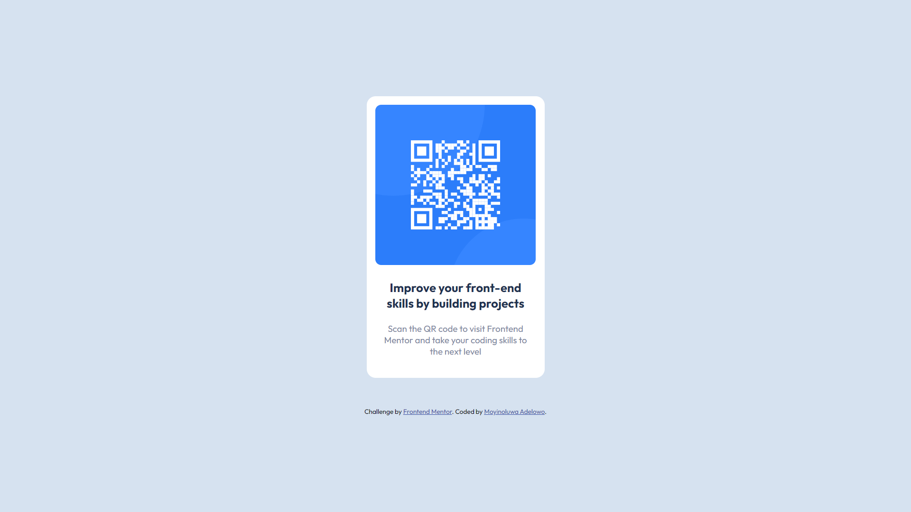

# Frontend Mentor - QR code component solution

This is a solution to the [QR code component challenge on Frontend Mentor](https://www.frontendmentor.io/challenges/qr-code-component-iux_sIO_H). Frontend Mentor challenges help you improve your coding skills by building realistic projects. 

## Table of contents

- [Frontend Mentor - QR code component solution](#frontend-mentor---qr-code-component-solution)
  - [Table of contents](#table-of-contents)
  - [Overview](#overview)
    - [Screenshot](#screenshot)
    - [Links](#links)
  - [My process](#my-process)
    - [Built with](#built-with)
    - [What I learned](#what-i-learned)
  - [Author](#author)

**Note: Delete this note and update the table of contents based on what sections you keep.**

## Overview

### Screenshot

### Links

- Solution URL: [Solution](https://gitlab.com/Moyinoluwa-10/frontend-mentor-qr-code-component)
- Live Site URL: [Live site](https://qrcode-compon.netlify.app/)

## My process

### Built with

- Semantic HTML5 markup
- CSS custom properties
- Flexbox
- Desktop-first workflow

### What I learned
  
- General base stylings
- Image fluid styling

If you want more help with writing markdown, we'd recommend checking out [The Markdown Guide](https://www.markdownguide.org/) to learn more.

## Author

- Website - [Moyinoluwa Adelowo](https://moyinadelowo.vercel.app/)
- Frontend Mentor - [@Moyinoluwa-10](https://www.frontendmentor.io/profile/Moyinoluwa-10)
- Twitter - [@MoyinAdelowo](https://www.twitter.com/MoyinAdelowo)
- LinkedIn - [Moyinoluwa Adelowo](https://www.linkedin.com/in/moyinoluwa-adelowo/)

