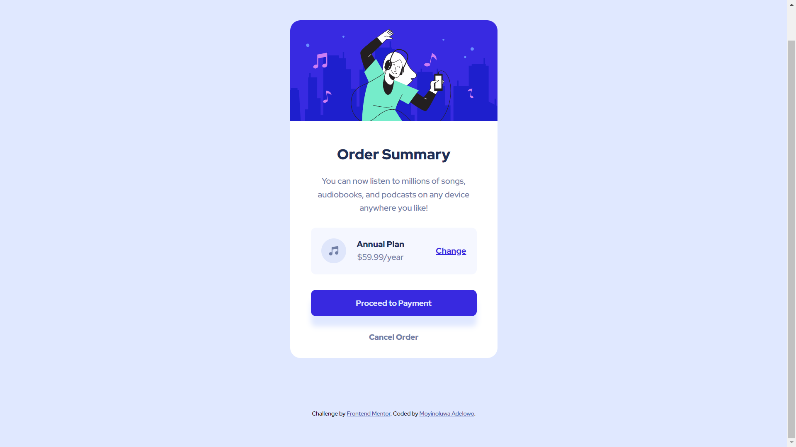

# Frontend Mentor - Order summary card solution

This is a solution to the [Order summary card challenge on Frontend Mentor](https://www.frontendmentor.io/challenges/order-summary-component-QlPmajDUj). Frontend Mentor challenges help you improve your coding skills by building realistic projects. 

## Table of contents

- [Frontend Mentor - Order summary card solution](#frontend-mentor---order-summary-card-solution)
  - [Table of contents](#table-of-contents)
  - [Overview](#overview)
    - [The challenge](#the-challenge)
    - [Screenshot](#screenshot)
    - [Links](#links)
  - [My process](#my-process)
    - [Built with](#built-with)
  - [Author](#author)

## Overview

### The challenge

Users should be able to:

- See hover states for interactive elements

### Screenshot

### Links

- Solution URL: [Solution](https://gitlab.com/Moyinoluwa-10/order-summary-card-component)
- Live Site URL: [Live site](https://order-summcard.netlify.app/)

## My process

### Built with

- Semantic HTML5 markup
- CSS custom properties
- Flexbox
- Desktop-first workflow

## Author

- Website - [Moyinoluwa Adelowo](https://moyinadelowo.vercel.app/)
- Frontend Mentor - [@Moyinoluwa-10](https://www.frontendmentor.io/profile/Moyinoluwa-10)
- Twitter - [@MoyinAdelowo](https://www.twitter.com/MoyinAdelowo)
- LinkedIn - [Moyinoluwa Adelowo](https://www.linkedin.com/in/moyinoluwa-adelowo/)

