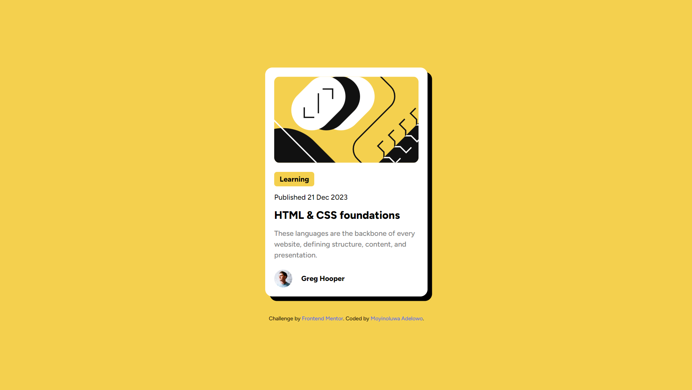

# Frontend Mentor - Blog preview card solution

This is a solution to the [Blog preview card challenge on Frontend Mentor](https://www.frontendmentor.io/challenges/blog-preview-card-ckPaj01IcS). Frontend Mentor challenges help you improve your coding skills by building realistic projects. 

## Table of contents

- [Frontend Mentor - Blog preview card solution](#frontend-mentor---blog-preview-card-solution)
  - [Table of contents](#table-of-contents)
  - [Overview](#overview)
    - [The challenge](#the-challenge)
    - [Screenshot](#screenshot)
    - [Links](#links)
  - [My process](#my-process)
    - [Built with](#built-with)
    - [What I learned](#what-i-learned)
    - [Continued development](#continued-development)
  - [Author](#author)

## Overview

### The challenge

Users should be able to:

- See hover and focus states for all interactive elements on the page

### Screenshot

### Links

- Solution URL: [Solution](https://gitlab.com/Moyinoluwa-10/frontend-mentor-blog-preview-card)
- Live Site URL: [Live site](https://blog-prevcard.netlify.app/)

## My process

### Built with

- [React](https://reactjs.org/) - JS library
- TypeScript
- [Tailwindcss](https://tailwindcss.com/) - For styles
- Mobile-first workflow
  
### What I learned

I learned the basics of using typescript with React.

### Continued development

I plan to continue learning more about typescript and how to use it with React.

## Author

- Website - [Moyinoluwa Adelowo](https://moyinadelowo.com)
- Frontend Mentor - [@Moyinoluwa-10](https://www.frontendmentor.io/profile/Moyinoluwa-10)
- Twitter - [@MoyinAdelowo](https://www.twitter.com/MoyinAdelowo)
- LinkedIn - [@Moyinoluwa Adelowo](https://www.linkedin.com/in/moyinoluwa-adelowo/)