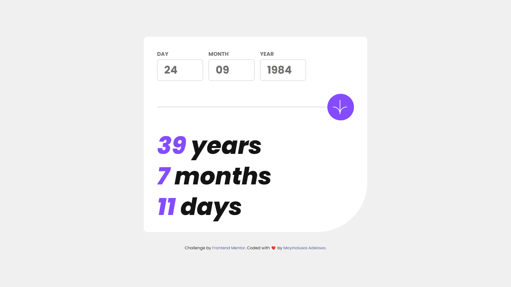

# Frontend Mentor - Age calculator app solution

This is a solution to the [Age calculator app challenge on Frontend Mentor](https://www.frontendmentor.io/challenges/age-calculator-app-dF9DFFpj-Q). Frontend Mentor challenges help you improve your coding skills by building realistic projects. 

## Table of contents

- [Frontend Mentor - Age calculator app solution](#frontend-mentor---age-calculator-app-solution)
  - [Table of contents](#table-of-contents)
  - [Overview](#overview)
    - [The challenge](#the-challenge)
    - [Screenshot](#screenshot)
    - [Links](#links)
  - [My process](#my-process)
    - [Built with](#built-with)
    - [What I learned](#what-i-learned)
    - [Continued development](#continued-development)
  - [Author](#author)


## Overview

### The challenge

Users should be able to:

- View an age in years, months, and days after submitting a valid date through the form
- Receive validation errors if:
  - Any field is empty when the form is submitted
  - The day number is not between 1-31
  - The month number is not between 1-12
  - The year is in the future
  - The date is invalid e.g. 31/04/1991 (there are 30 days in April)
- View the optimal layout for the interface depending on their device's screen size
- See hover and focus states for all interactive elements on the page
- **Bonus**: See the age numbers animate to their final number when the form is submitted

### Screenshot




### Links

- Solution URL: [Solution](https://gitlab.com/Moyinoluwa-10/frontend-mentor-age-calculator-apps)
- Live Site URL: [Live site](https://age-calcapp.netlify.app/)

## My process

### Built with

- Mobile-first workflow
- TypeScript
- [React](https://reactjs.org/) - JS library
- [Next.js](https://nextjs.org/) - React framework
- [Tailwind-css](https://tailwindcss.com/) - For styles
- [Framer Motion](https://www.framer.com/motion/) - For styles


### What I learned

How to use ```AnimatePresence``` for animation.


```tsx
<AnimatePresence initial={false} mode="wait">
  <motion.span
    className="text-purple inline-block"
    initial={{ opacity: 0, x: -10 }}
    animate={{ opacity: 1, x: 0 }}
    exit={{ opacity: 0, x: -10 }}
    key={yearsDiff}
  >
    {yearsDiff}
  </motion.span>
</AnimatePresence>
```


### Continued development

I want to continue learning animations using framer-motion.


## Author

- Website - [Moyinoluwa Adelowo](https://moyinadelowo.com)
- Frontend Mentor - [@Moyinoluwa-10](https://www.frontendmentor.io/profile/Moyinoluwa-10)
- Twitter - [@MoyinAdelowo](https://www.twitter.com/MoyinAdelowo)
- LinkedIn - [@Moyinoluwa Adelowo](https://www.linkedin.com/in/moyinoluwa-adelowo/)

